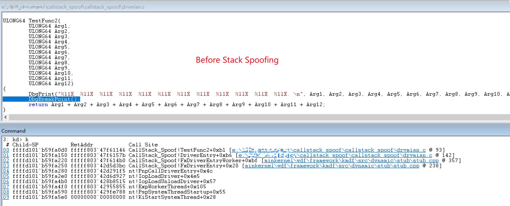
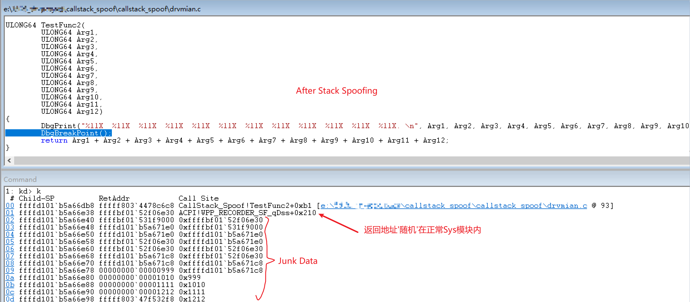

[中文](./readme.md) | English
# Manually Forging Call Stacks to Defeat Stack Unwinding, Supporting Both R0/R3, with Source Code

## Stack Unwinding

Stack unwinding is often used to inspect caller information for sensitive APIs:

1. Detecting **fileless** injection (remote Shellcode calls):

   > After analyzing a cheat sample for a certain domestic extraction shooter game, I found that the cheat used manual mapping to inject a DLL into the game process.
   >
   > By calling Unreal Engine (UE) related interfaces, it bypassed Object pointer encryption and coordinate encryption, and also leveraged the engine’s ray-casting functionality (`LineTraceSingle`) for cover detection and similar logic, enabling various features that severely disrupted game balance.
   >
   > By performing stack unwinding on certain sensitive APIs, any caller outside the whitelist could be identified, and the abnormal call information could then be logged and reported to the server.
   >
   > The analysis of this cheat sample is basically complete. If I have time later, I may publish it. If you are interested, feel free to follow.

2. Detecting **moduleless** drivers:

   > In today’s game security and kernel-level anti-cheat confrontation, in order to hide driver characteristics, this kind of scheme is usually divided into two layers. The outer driver acts only as a MapLoader (signed with WHQL or at least not blacklisted by the anti-cheat), responsible for PE mapping, relocation fixing, import table reconstruction, and so on. The inner functional module resides and executes in kernel mode (R0) in the form of shellcode or a moduleless image. In this case, common kernel enumeration / ARK tools cannot find the driver in the loaded driver list.
   >
   > At this point, stack unwinding can be used again: once the caller is traced back to an address that does not fall within any legitimate module range, the abnormal call chain can be logged and reported to the server.

---

## Demonstration of Manual Stack Spoofing

The effect is shown below:





---

## Implementation Idea

### Polluting Return Addresses on the Stack

An assembly function is needed here as a wrapper and as a general-purpose function invoker. Its responsibilities are:

1. Encrypting and decrypting the return address on the stack at specific moments (using a custom or random key)
2. Constructing a new call stack and invoking the real target function

The assembly code is as follows:

```assembly
Asm_SpoofWrapper PROC
	mov r11, g_XorKey
	xor [rsp], r11

	push rsi
	push rdi
	sub rsp, 300h

	lea rsi, [rsp + 340h]
	lea rdi, [rsp + 20h]
	mov r10, rcx   
	mov ecx, 40h   
	rep movsq      
	mov rcx, r10   

	call qword ptr [rsp + 338h]

	add rsp, 300h
	pop rdi
	pop rsi

	mov r11, g_XorKey
	xor [rsp], r11

	ret
Asm_SpoofWrapper ENDP
```

---

### Fixing Wrapper Shellcode Offsets

1. There is still a problem at this point: the `call` instruction inside `Asm_SpoofWrapper` will still push a return address belonging to the current driver onto the stack. So the idea is to move the wrapper into a legitimate module instead. The wrapper bytes are shown below.
2. However, moving the wrapper into a legitimate module introduces another issue: the key used for encryption/decryption is obtained via RIP-relative addressing, so its relative offset must be fixed up dynamically.

```c
UCHAR SpoofShellCode[] = 
{
	// 1. Dynamically obtain the key and encrypt the return address
	0x4C, 0x8B, 0x1D, 0x00, 0x00, 0x00, 0x00,  // mov     r11, XorKey
	0x4C, 0x31, 0x1C, 0x24,                    // xor     [rsp+0], r11

	// 2. Save non-volatile registers
	0x56,                                      // push    rsi
	0x57,                                      // push    rdi

	// 3. Allocate 0x300 bytes of stack space
	0x48, 0x81, 0xEC, 0x00, 0x03, 0x00, 0x00,  // sub     rsp, 300h

	// 4. Set source and destination addresses for memory copy
	0x48, 0x8D, 0xB4, 0x24, 0x40, 0x03, 0x00, 0x00, // lea   rsi, [rsp + 340h]
	0x48, 0x8D, 0x7C, 0x24, 0x20,              // lea     rdi, [rsp + 20h]

	// 5. Temporarily save rcx and perform memory copy (rep movsq)
	0x4C, 0x8B, 0xD1,                          // mov     r10, rcx
	0xB9, 0x40, 0x00, 0x00, 0x00,              // mov     ecx, 40h
	0xF3, 0x48, 0xA5,                          // rep     movsq
	0x49, 0x8B, 0xCA,                          // mov     rcx, r10

	// 6. Call the target function
	0xFF, 0x94, 0x24, 0x38, 0x03, 0x00, 0x00,  // call    [rsp + 338h]

	// 7. Restore stack space and registers
	0x48, 0x81, 0xC4, 0x00, 0x03, 0x00, 0x00,  // add     rsp, 300h
	0x5F,                                      // pop     rdi
	0x5E,                                      // pop     rsi

	// 8. Dynamically obtain the key and decrypt the return address
	0x4C, 0x8B, 0x1D, 0x00, 0x00, 0x00, 0x00,  // mov     r11, XorKey
	0x4C, 0x31, 0x1C, 0x24,                    // xor     [rsp+0], r11

	// 9. Return
	0xC3                                       // retn
};

#pragma pack(push, 1)
typedef struct _SPOOF_SHELLCODE_TEMPLATE {
	UCHAR  mov_r11_opcode[3];      // mov r11, xxx
	LONG32 first_xor_key_offset;
	UCHAR  pad_1[56];
	UCHAR  mov_r11_opcode_2[3];    // mov r11, xxx
	LONG32 second_xor_key_offset;
	UCHAR  pad_2[5];
} SPOOF_SHELLCODE_TEMPLATE, *PSPOOF_SHELLCODE_TEMPLATE;
#pragma pack(pop)

#define OFFSET(type, field) ((ULONG_PTR)(&((type*)0)->field))
```

---

### Placement of the Wrapper Shellcode

Traverse the system’s loaded driver modules, randomly select a legitimately loaded module, and search for a **code cave** within its address range. If one is found, write the shellcode into it. Pay attention to the following:

1. Prefer searching within the `.text` section of the driver module, because the `PAGE` section may be paged out to disk when system memory is under pressure.
2. Avoid modules such as `ntoskrnl`, `win32k` (graphics subsystem), and `hal` (hardware abstraction layer), since modifying them may trigger PatchGuard.

---

## Open-Source GitHub Repository

In theory, this solution supports both R0 and R3, and the implementation is largely similar on both sides. The R0 driver source code has already been open-sourced. The test environment is Win10 19044. If you are interested, feel free to give it a Star.